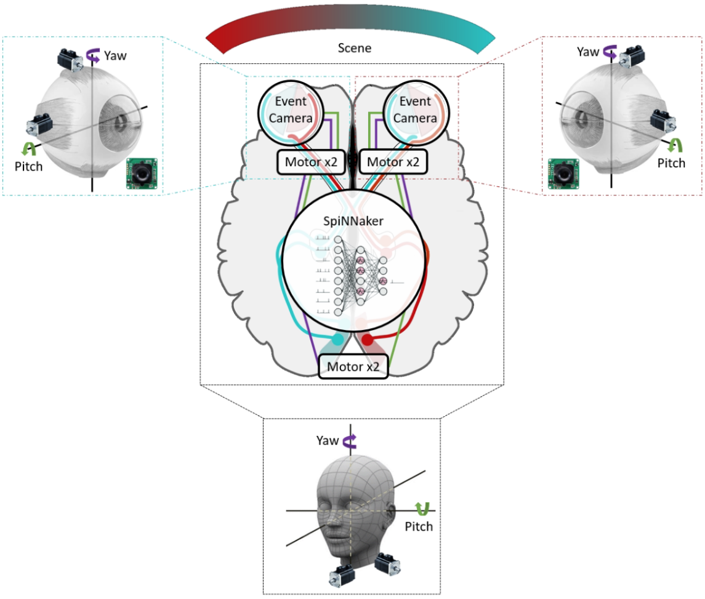
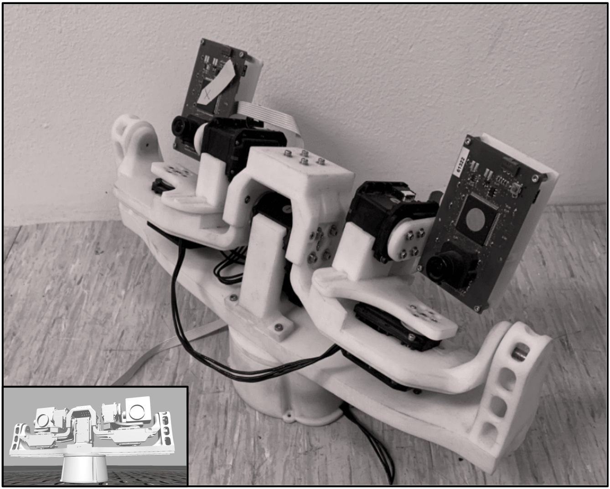

# Closed-loop learning for visuo-motor coordination using neuromorphic hardware.

## Context:

Computational models of the brain have so far tended to focus either on biological realism or on task performance, but have rarely combined both aspects in a unified framework. A variety of models is available, each covering different parts of the brain, but models integrating multiple brain regions are generally lacking. Visuo-motor tasks are a prime example of complex tasks requiring the coordination of multiple brain regions, which moreover lend themselves to neurorobotics applications. It is unknown how the brain manages to perform visuo-motor coordination at its extremely low power consumption, but spike-based communication may hold an important key to its high energy efficiency.

## Brief description of the project:

This project aims at bringing together biologically plausible models of different brain regions (cerebellum, motor cortex, visual cortex) into a unified/simplified whole performing a visuo-motor task. In particular, a robotic head (see Illustrations 1. and 2.) with two event cameras for eyes and six servomotors allowing yaw and pitch of both eyes and neck will be used to generate saccades and produce vestibulo-ocular reflexes to detect and follow salient objects in the scene.

**llustration 1.** Robotic head: block diagram with sensors, actuators and computing unit 

The robotic head will be controlled by spiking neural networks (SNNs) running on SpiNNaker, a neuromorphic computing platform. The SNNs will integrate sensory information (visual, proprioceptive, vestibular) and will produce motor output as a response in order to perform ‘hard-coded’ pre-defined tasks. Cognitive behavior will be tackled on a second stage if time allows it. Validation of the spiking models will be done in simulation prior to be implemented on the physical setup. For that, the neurorobotics platform (NRP) will be used.

**Illustration 2.** Robotic Head: Physical Setup 

### The internship work includes:
- Literature review (cerebellum, motor cortex, visual cortex) 	
- Design/simplification of SNNs for visuo-motor function 	
- Simulation of embodied agent on the NRP 	
- Implementation of spiking models on SpiNNaker 	
- Hardware setup (event cameras + motors + IMUs).

### Student:
- Adrien Delpierre (ajmde@kth.se)

### Supervisor:
- Jörg Conradt (jconradt@kth.se)

### Co-supervisors:
- Juan P. Romero B. (jprb@kth.se)
- Jens E. Pedersen (jeped@kth.se)

### Resources:
- [Zotero Collection](https://www.zotero.org/groups/2644361/ncs_delpierre/library)
- [LaTeX document](https://www.overleaf.com/read/ngqybnswmzmh)

### More information:
- [Human Brain Project (HBP)](https://www.humanbrainproject.eu/en/)
- [Norse](https://github.com/norse/norse)
- [SpiNNaker](http://spinnakermanchester.github.io/spynnaker/5.0.0/PyNNOnSpinnakerInstall.html)
- [SpyNNaker8](https://spinnaker8manchester.readthedocs.io/en/master/spynnaker8/modules.html)
- [PyNN](http://neuralensemble.org/docs/PyNN/index.html)
- [Neuro-Robotics Platform (NRP)](https://neurorobotics.net/local_install.html)
